# Carousel Studio - prototype

[English](README.md) | [Русский](README.ru.md)

**A local prototype, not a production service.** Create carousel slides from a prompt, review the plan, generate pictures, and edit the result as separate layers.


*Editor: a four-slide series with separate text, picture, and graphic layers.*

## Features

- Project size, audience, goal, scenario, and call to action.
- Review slide text, layouts, and picture prompts before generating images.
- Shared editorial guidance favors natural, concise language and concrete actions; it preserves source facts and the author's voice.
- Five visual directions, six layouts, twelve built-in fonts, and uploaded fonts.
- Brand colors, heading/body fonts, logo, and contact details.
- Move, resize, rotate, reorder, hide, and lock text, photos, and shapes.
- Multiple photos per slide, cropping, and editable graphic layers.
- Consistent fonts across a series, gradient text, and curved arrows.
- Rebuild a group's design into a new group while keeping the original layers.
- Analyze references or a whole group; rewrite text or change the topic.
- Edit existing slides and groups from a prompt: text, fonts, colors, geometry, layer order, and group structure.
- Preview exact operations, apply explicitly, undo, and reject stale responses.
- Local project library, saved generation drafts, partial-image retries, and JSON transfer.
- Technical checks for text overflow, bounds, contrast, and image resolution.
- PNG and ZIP export in project, square, portrait, story, or landscape sizes.
- Separate design, brief/brand, and series review workspaces with a scrollable filmstrip and contextual properties.
- Project library in a focus-managed dialog, stable preview frames, and protected result application.
- Short interface transitions with keyboard and reduced-motion support; canvas first on narrow screens.

## Style examples

Each example was generated through the app's connected text and image models, then exported with the editor's PNG renderer at **1080×1350**. The brief and copy stay the same. Direction examples request their recommended composition; picture styles share one poster layout for comparison. Click an image for the full-size export.

### Project styling: layouts and typography

Five treatments of the same brief, with different layouts, palettes, and fonts. Topic-based styling shows the choices made for this example rather than a fixed palette.

<table>
<tr>
<td align="center"><strong>Topic-based</strong><br><a href="docs/examples/direction-auto.png">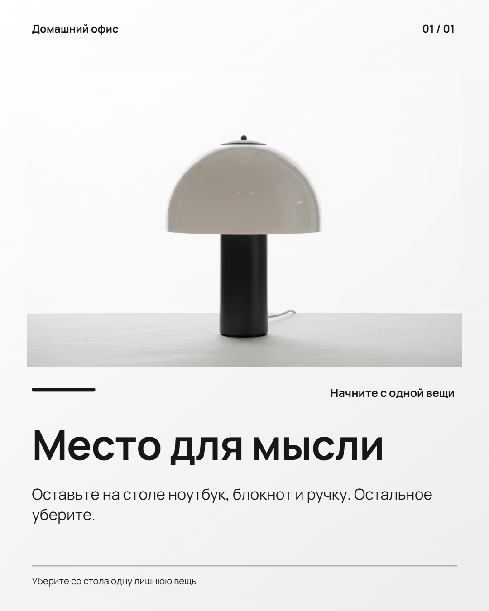</a><br><em>Poster with a neutral palette.</em></td>
<td align="center"><strong>Magazine</strong><br><a href="docs/examples/direction-editorial.png">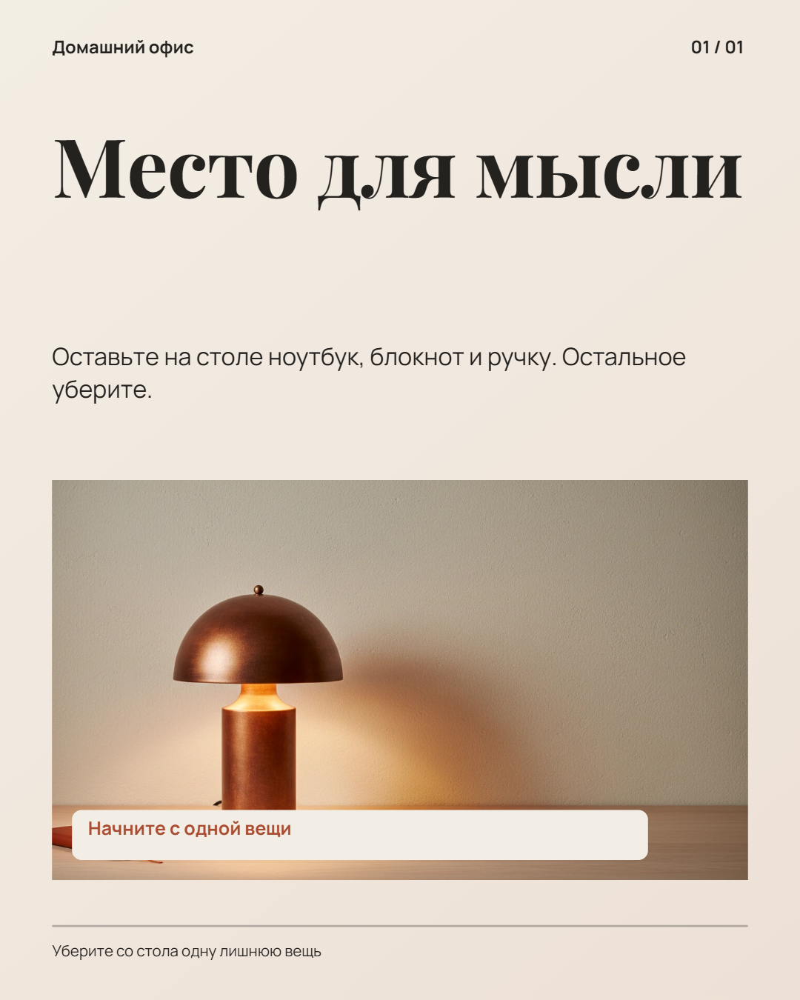</a><br><em>Serif headline above the picture.</em></td>
<td align="center"><strong>Bold</strong><br><a href="docs/examples/direction-bold.png">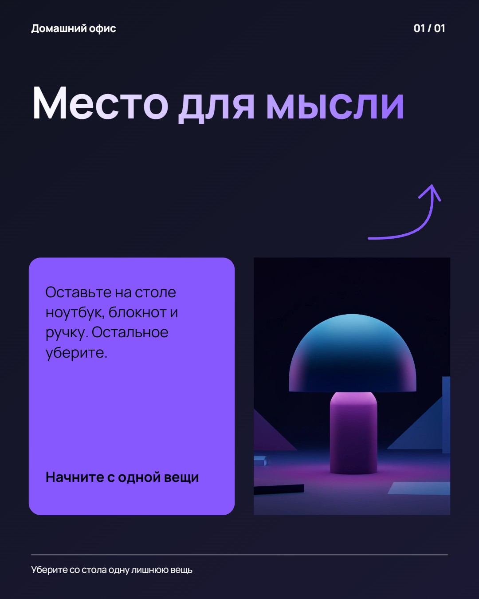</a><br><em>Colored cards and a 3D object.</em></td>
</tr>
<tr>
<td align="center"><strong>Clean</strong><br><a href="docs/examples/direction-minimal.png">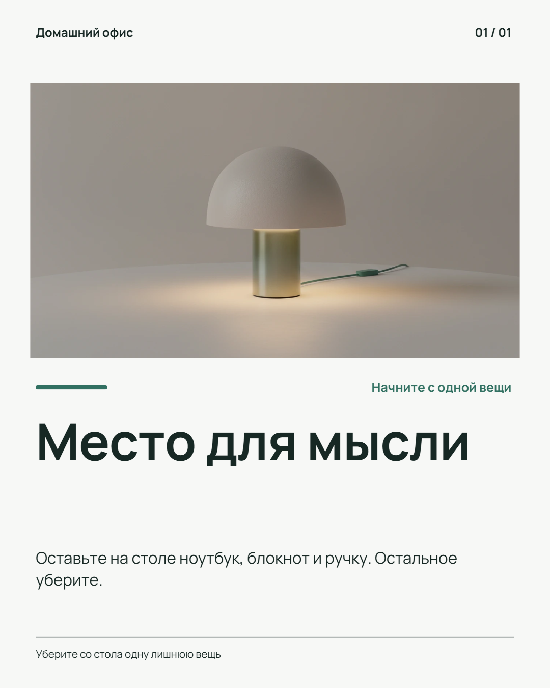</a><br><em>Two columns and a simple grid.</em></td>
<td align="center"><strong>Premium</strong><br><a href="docs/examples/direction-luxe.png">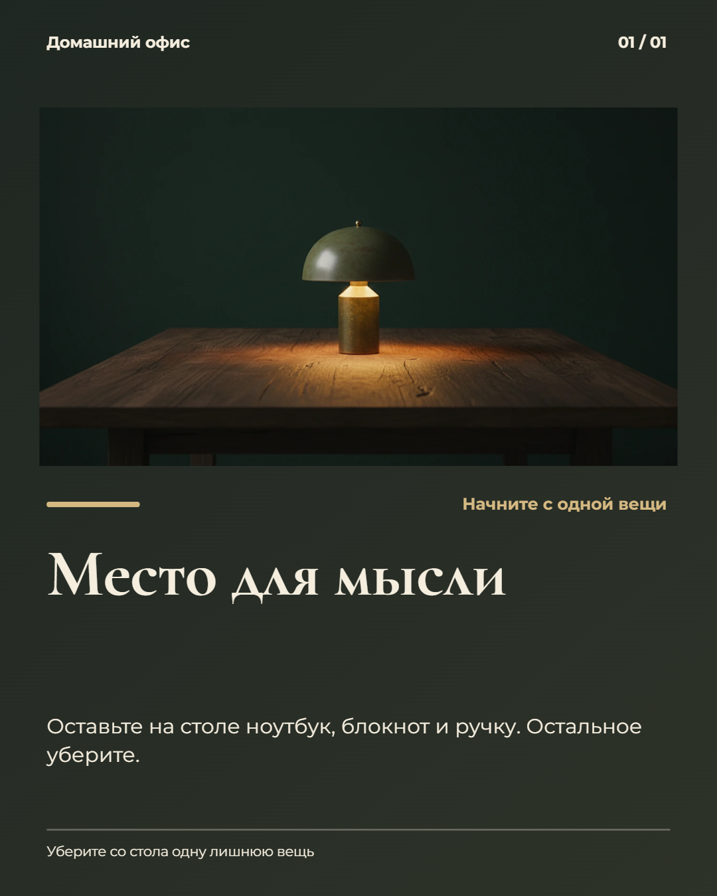</a><br><em>Large serif type on a dark background.</em></td>
<td></td>
</tr>
</table>

### Picture techniques: one subject, six styles

Six image techniques in the same poster layout, typeface, and palette. Only the picture style changes. The lamp is a fictional subject, not a product-identity test.

<table>
<tr>
<td align="center"><strong>3D objects</strong><br><a href="docs/examples/picture-object.png">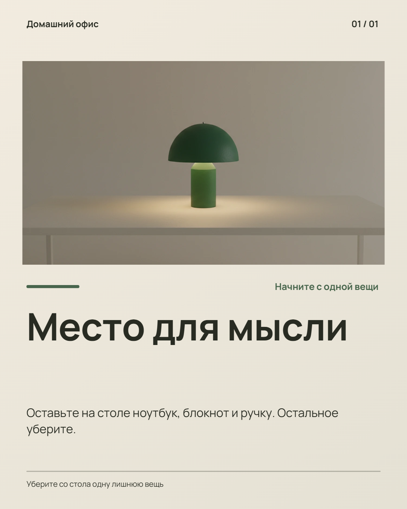</a><br><em>Sculptural shapes and matte materials.</em></td>
<td align="center"><strong>Product photography</strong><br><a href="docs/examples/picture-photo.png">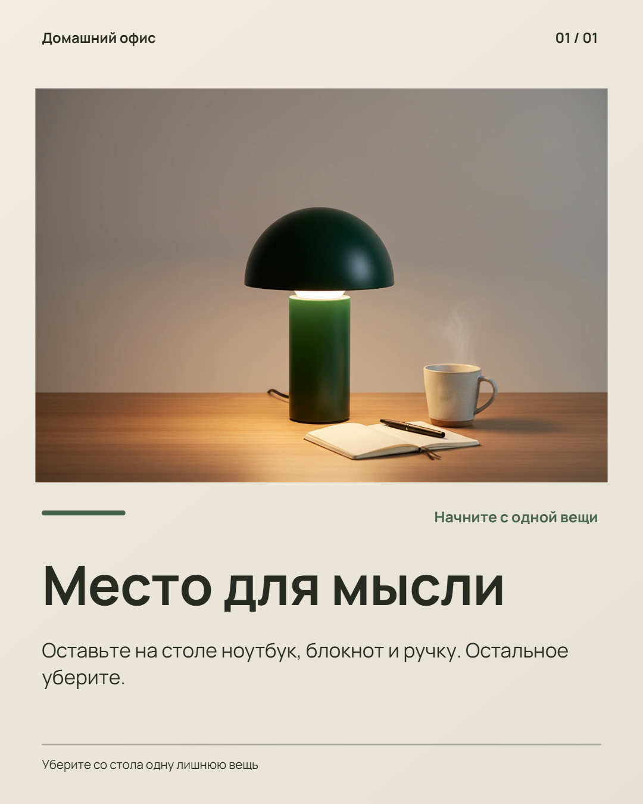</a><br><em>Photographic scene with a cup and notebook.</em></td>
<td align="center"><strong>Illustration</strong><br><a href="docs/examples/picture-illustration.png">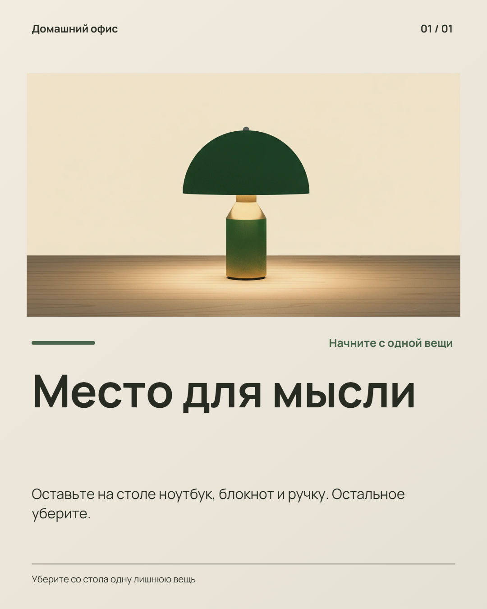</a><br><em>Flat drawing with a bold outline.</em></td>
</tr>
<tr>
<td align="center"><strong>Editorial collage</strong><br><a href="docs/examples/picture-collage.png">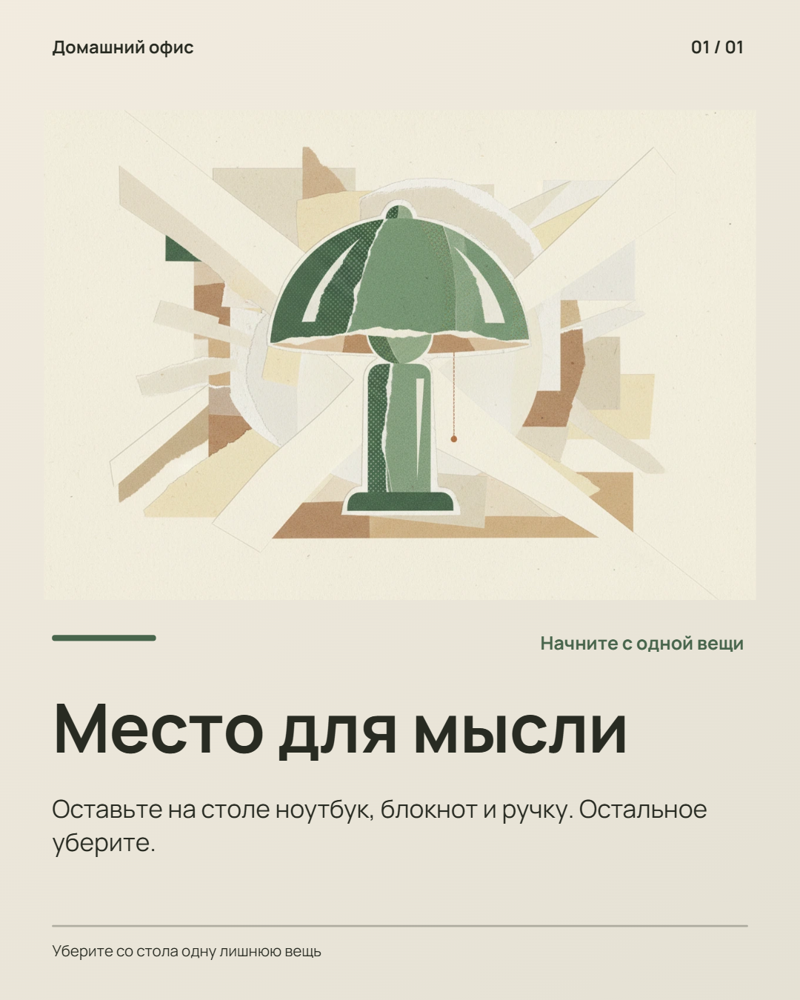</a><br><em>Cutout fragments and torn edges.</em></td>
<td align="center"><strong>Cinematic photography</strong><br><a href="docs/examples/picture-cinematic.png">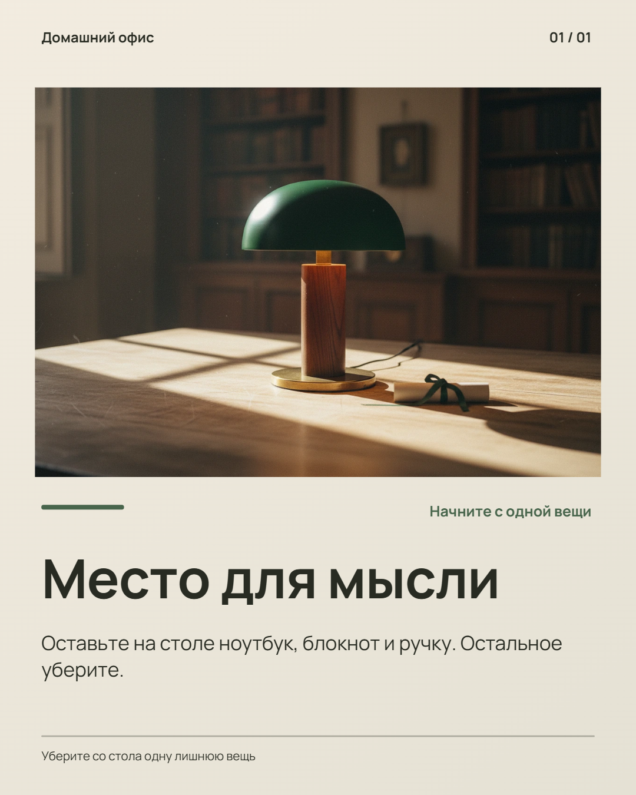</a><br><em>Room depth, side light, and film grain.</em></td>
<td align="center"><strong>Paper and textures</strong><br><a href="docs/examples/picture-paper.png">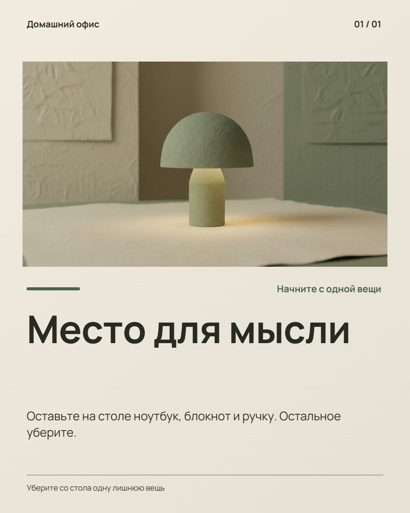</a><br><em>Paper sculpture with a textured surface.</em></td>
</tr>
</table>

## Screenshots

The interface currently uses Russian. FORM is a fictional demonstration collection.

### Setup and editing


*Project settings: topic, audience, palette, and brand fonts.*


*Selected headline: text, font, color, and geometry controls.*

### Review and export


*Four-slide overview with technical review results.*


*Exported "Quiet ritual" slide, PNG at 1080×1350.*

### Prompt edits and mobile view


*Headline replacement preview before applying the change.*

The dialogue screenshot shows a controlled preview response. It demonstrates the interface and does not establish live model quality.


*Phone view: the canvas and selected text layer.*

## Run with Docker

Requires Docker with Compose. The image pins **Node.js 26.10.0**.

```sh
git clone https://github.com/intrider-dev/carousel-studio-prototype.git
cd carousel-studio-prototype
mkdir ../carousel-studio-config
cp provider.env.example ../carousel-studio-config/provider.env
cp .env.example .env
```

On PowerShell, use `New-Item -ItemType Directory` and `Copy-Item` if needed.

Set `CHAT_API_KEY`, `CHAT_BASE_URL`, and `CHAT_MODEL` in `provider.env` **outside the repository**. The template uses an OpenAI-compatible provider. Text, vision, structured output, and image support depend on the provider and model. Requests can incur charges.

```sh
docker compose up -d --build
```

Open **http://localhost:3080**. The port is bound to loopback only.

| Route | Purpose |
| --- | --- |
| `/` | Editor, brand settings, technical review, and project library |
| `/chat` | Prompt-driven creation and optional chat integration |
| `/basic` | Manual six-slide checklist |

The legacy chat is **not included**. Set `LEGACY_URL` in `.env` for a compatible external chat. The editor and direct generation connector work separately; the collapsed chat panel reports a connection error when that service is unavailable.

For manual editing without a provider, keep the external configuration file present with empty values. Generation will be unavailable.

## Main flow

1. Create a project: size, topic, visual direction, and optional brand.
2. Open the dialogue, choose available models in settings, and describe the series.
3. Review the plan. Edit headings, body text, layouts, and picture prompts.
4. Generate pictures, preview the series, and add it as a group.
5. Edit layers, run review, and export PNG or ZIP.
6. Reload and reopen the project. Export JSON for transfer or backup.

Use **Дизайн** for the canvas and layers, **Бриф и бренд** for project settings, and **Проверка серии** to view the whole series and open a slide or issue. Select a layer to show its text, font, and color before geometry controls. **Проекты** opens a dialog; Escape closes it and restores focus.

For existing content, choose **Изменить по запросу** and the current slide or group. Describe the changes, review the operation list and previews, then apply. **Переделать дизайн** rebuilds compositions in place while preserving added layers; pictures can be reused or regenerated. **Переписать текст** keeps the visual layers. **Сменить тему** replaces the selected content rather than appending a group. Picture replacement sends the current picture as a reference when the selected model supports image input.

## Prototype limitations

- Projects live in the current browser's IndexedDB. No accounts, cloud sync, shared projects, or collaboration.
- No durable job queue, billing, or production authentication. Do not expose the local server publicly without further security work.
- Generated pictures can change product details between slides. Use original photos when exact identity matters.
- Technical checks do not verify facts or predict conversion. Review content and images before publishing.
- New export aspect ratios need visual review. Modified compositions preserve layers through scaling.
- Digital PNG exports only; no print-ready CMYK/PDF, social publishing, or scheduler.
- Compatibility with arbitrary chat applications is not guaranteed. Only the documented local environment has been verified.
- Structured redesign and rewriting accept up to twelve slides per request. Operation plans accept up to eighty operations, within the editor's twelve-group, twenty-slide, and forty-layer limits. There is no unrestricted command execution or guaranteed interpretation of every prompt.

## Development

Use the Node version in `.nvmrc`.

```sh
npm ci
npm test
npm run lint
npm run build
npm run test:browser
```

Browser checks require the Docker service, a browser, and npm access for Playwright CLI. The regression suite uses controlled responses and does not purchase generation requests. Live scripts are separate and can incur charges.

Current baseline: **38 unit tests and 168 browser assertions**. See [development and manual checks](docs/DEVELOPMENT.md), [architecture](docs/ARCHITECTURE.md), and [project instructions](AGENTS.md).

Standard shadcn/ui components are used without theme redesign. The vendored stylesheet retains its [MIT notice](src/styles/vendor/shadcn.LICENSE.md); dependency and font licenses remain with their packages.
