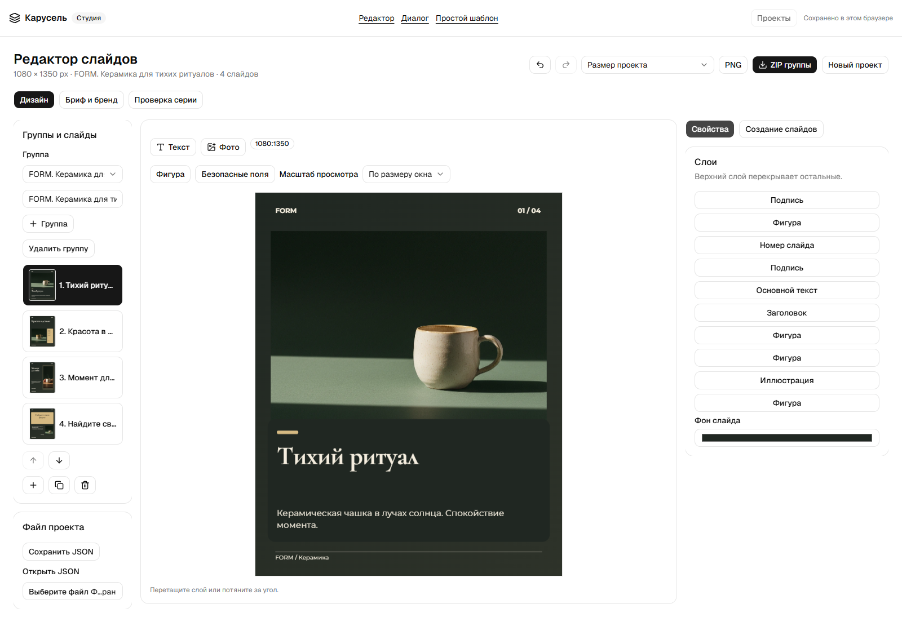
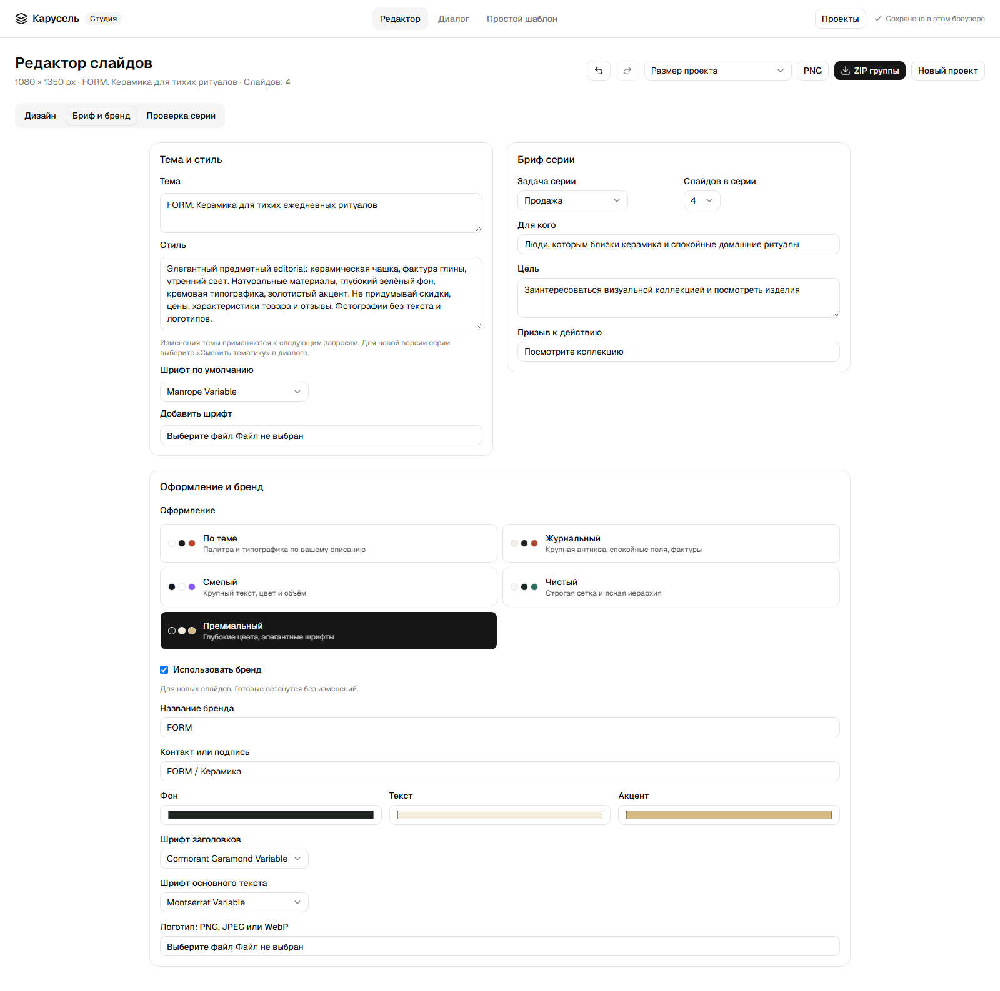
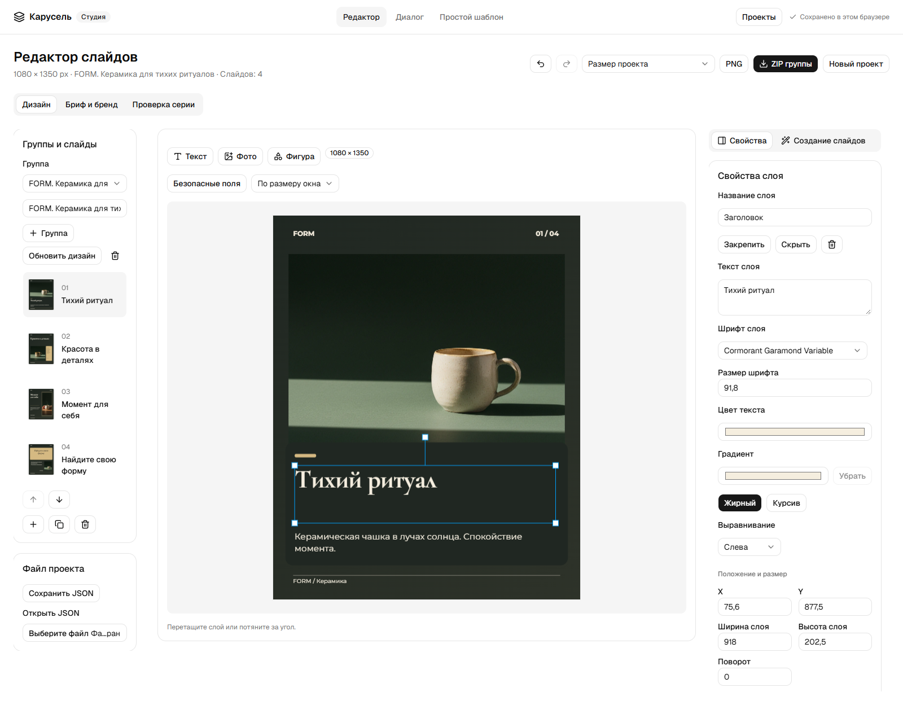
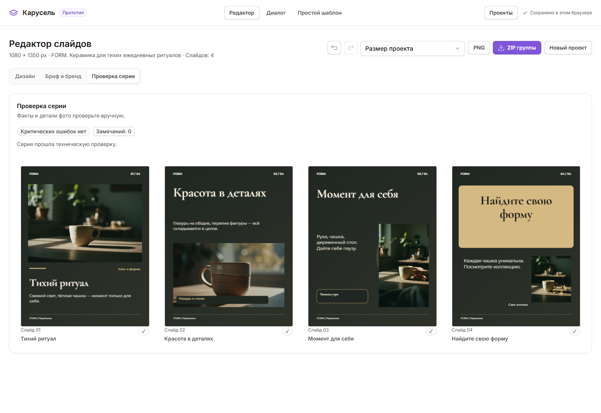
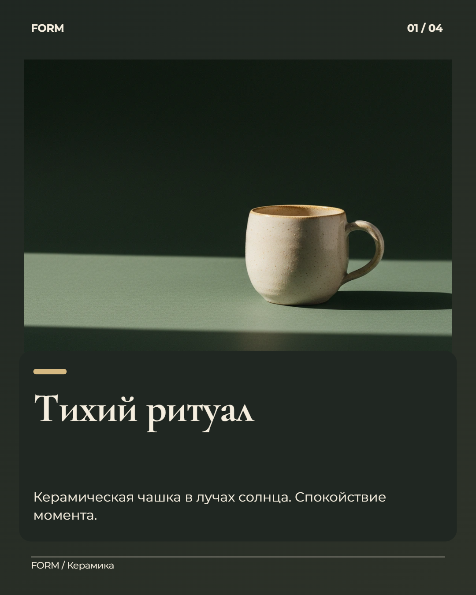
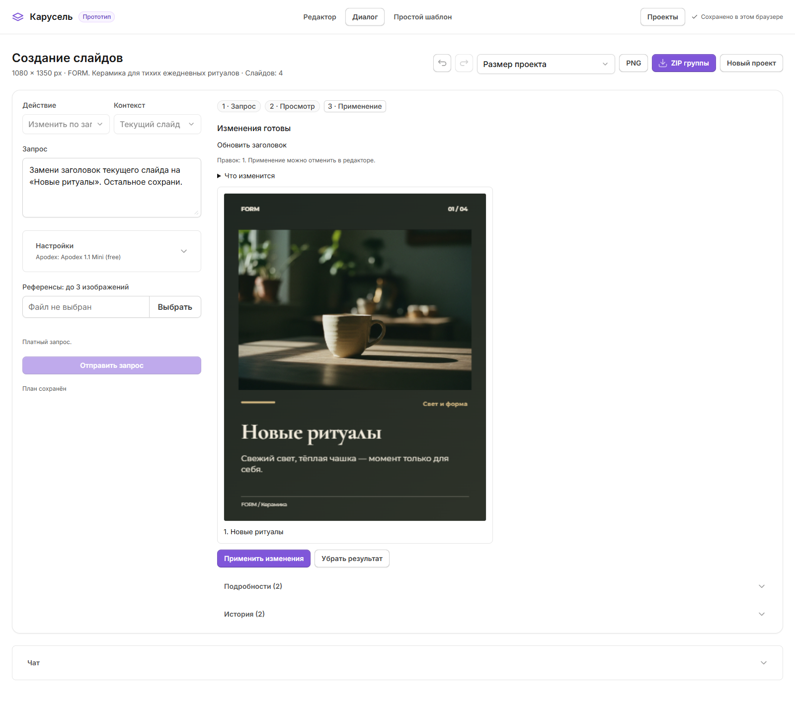
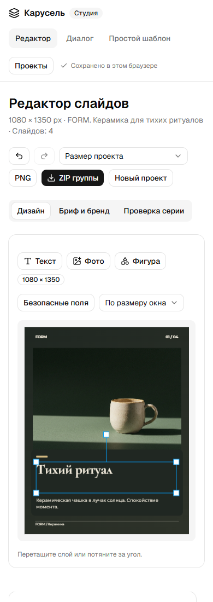

# Carousel Studio - прототип

[English](README.md) | [Русский](README.ru.md)

**Локальный прототип, не готовый коммерческий сервис.** Создание каруселей по запросу: согласование плана, генерация изображений и редактирование отдельных слоёв.



## Возможности

- Размер, аудитория, цель, сценарий и призыв к действию.
- Правка текстов, композиций и сюжетов до создания изображений.
- Общие редакционные правила: живой язык, короткие тексты и конкретные действия с сохранением фактов и авторского голоса.
- Пять вариантов оформления, шесть композиций, двенадцать шрифтов и загрузка собственных.
- Палитра бренда, шрифты заголовков и текста, логотип и контакты.
- Перемещение, размер, поворот, порядок, видимость и блокировка слоёв.
- Несколько фотографий, кадрирование и графические элементы.
- Единые шрифты серии, градиентный текст и рисованные стрелки.
- Обновление дизайна в новой группе с сохранением исходных слоёв.
- Анализ референсов или всей группы, переписывание текста и смена темы.
- Правки текущих слайдов и групп по запросу: текст, шрифты, цвета, геометрия, слои и состав группы.
- Предпросмотр конкретных операций, явное применение, отмена и защита от устаревших ответов.
- Библиотека проектов, сохранение плана, повтор недостающих изображений и перенос через JSON.
- Проверка переполнения текста, границ, контраста и разрешения изображений.
- Экспорт PNG и ZIP в размере проекта или популярных форматах публикаций.
- Отдельные режимы дизайна, брифа и проверки серии; лента слайдов и свойства выбранного слоя.
- Библиотека проектов в отдельном окне, стабильные превью и защита от повторного применения.
- Короткие переходы с поддержкой клавиатуры и уменьшения анимаций; холст первым на узком экране.

## Скриншоты

Интерфейс на русском. FORM - вымышленная коллекция для демонстрации.













Скриншот диалога показывает предпросмотр с подменённым ответом. Это демонстрация интерфейса, а не подтверждение качества реальной генерации.

## Запуск через Docker

Нужен Docker с Compose. В образе закреплён **Node.js 26.10.0**.

```sh
git clone https://github.com/intrider-dev/carousel-studio-prototype.git
cd carousel-studio-prototype
mkdir ../carousel-studio-config
cp provider.env.example ../carousel-studio-config/provider.env
cp .env.example .env
```

В PowerShell можно использовать `New-Item -ItemType Directory` и `Copy-Item`.

Заполните `CHAT_API_KEY`, `CHAT_BASE_URL` и `CHAT_MODEL` в `provider.env` **вне репозитория**. Поддержка текста, изображений, анализа фото и структурированных ответов зависит от провайдера и моделей. Запросы могут быть платными.

```sh
docker compose up -d --build
```

Откройте **http://localhost:3080**. Порт доступен только на текущем компьютере.

| Страница | Назначение |
| --- | --- |
| `/` | Редактор, бренд, проверка и библиотека проектов |
| `/chat` | Создание слайдов и подключение чата |
| `/basic` | Ручной чек-лист на шесть слайдов |

Исходный чат **не входит в репозиторий**. Для совместимого внешнего чата укажите `LEGACY_URL` в `.env`. Редактор и прямое создание слайдов работают отдельно; без внешнего чата его свёрнутая панель показывает ошибку подключения.

Для ручной работы без провайдера оставьте внешний файл конфигурации с пустыми значениями. Генерация будет недоступна.

## Основной путь

1. Создайте проект: размер, тема, оформление и при необходимости бренд.
2. Откройте диалог, выберите доступные модели и опишите серию.
3. Исправьте план: заголовки, тексты, композиции и сюжеты изображений.
4. Создайте изображения, просмотрите результат и добавьте группу.
5. Отредактируйте слои, проверьте серию и скачайте PNG или ZIP.
6. Перезагрузите страницу и откройте сохранённый проект. Для переноса скачайте JSON.

«Дизайн» открывает холст и слои, «Бриф и бренд» - настройки проекта, «Проверка серии» - обзор всех слайдов с переходом к слайду или замечанию. При выборе слоя текст, шрифт и цвет находятся перед координатами. «Проекты» открывает отдельное окно; Escape закрывает его и возвращает фокус.

Для существующего проекта выберите «Изменить по запросу» и контекст: текущий слайд или группа. Опишите изменения, просмотрите «Что изменится» и примените результат. «Переписать текст» сохраняет оформление; «Переделать дизайн» сохраняет ручные слои и может использовать прежние фото; смена темы заменяет выбранные слайды на месте. При замене фото исходное изображение передаётся совместимой модели как референс.

## Ограничения прототипа

- Проекты хранятся в IndexedDB текущего браузера. Нет аккаунтов, облачной синхронизации и совместной работы.
- Нет постоянной очереди заданий, биллинга и авторизации публичного сервиса. Для публичного запуска нужна доработка безопасности.
- При генерации могут меняться детали товара. Для точного изображения используйте исходные фотографии.
- Проверка не подтверждает факты и не прогнозирует конверсию. Перед публикацией нужен просмотр текста и изображений.
- Другие соотношения сторон нужно проверить отдельно. Изменённые композиции сохраняют слои при масштабировании.
- Только цифровые PNG: нет печати в CMYK/PDF, публикации в соцсетях и планировщика.
- Совместимость с любым внешним чатом не гарантируется. Проверено документированное локальное окружение.
- План правок ограничен 80 операциями; проект - 12 группами, группа - 20 слайдами, слайд - 40 слоями. Переписывание и переделка дизайна охватывают до 12 выбранных слайдов за запрос. Произвольная интерпретация любого запроса не гарантируется.

## Разработка

Используйте версию Node из `.nvmrc`.

```sh
npm ci
npm test
npm run lint
npm run build
npm run test:browser
```

Браузерным проверкам нужны Docker-сервис, браузер и доступ к npm для Playwright CLI. Регрессионный набор подменяет ответы и не расходует баланс. Сценарии реальной генерации запускаются отдельно и могут быть платными.

Текущий набор: **36 модульных тестов и 142 браузерных проверки**. Подробнее: [разработка и тестирование](docs/DEVELOPMENT.md), [архитектура](docs/ARCHITECTURE.md), [правила проекта](AGENTS.md).

Используются стандартные компоненты shadcn/ui без изменения темы. Копия CSS сохраняет [лицензию MIT](src/styles/vendor/shadcn.LICENSE.md); лицензии зависимостей и шрифтов находятся в пакетах.
