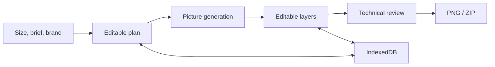

# Architecture

A single-user local prototype: React 19, TypeScript, Vite, standard shadcn/ui, Konva, Zod, IndexedDB, and a small Node HTTP server.

## Source map

| File | Responsibility |
| --- | --- |
| `src/studio/Studio.tsx` | Project state, history, workspace, controls, imports, exports |
| `shared/design.ts` | Brief, brand, and visual directions |
| `shared/proposal.ts` | Generation contract and visual vocabulary |
| `shared/edit-plan.ts`, `src/studio/edits.ts` | Validated operations, scope bindings, revisions, in-place replacement |
| `src/studio/edit-preview.tsx` | Exact operation review and composed previews |
| `src/studio/model.ts` | Document validation, identities, groups, counters |
| `src/studio/connector.tsx` | Models, generation, plan review, analysis, application |
| `src/studio/illustrations.ts` | Frame-aware pictures and partial retries |
| `src/studio/art-direction.ts`, `layouts.ts` | Brand rules and editable compositions |
| `src/studio/drawing.ts`, `canvas.tsx` | Common drawing path for canvas and PNG |
| `src/studio/text-layout.ts`, `fonts.ts` | Fonts, measurements, fitting |
| `src/studio/storage.ts` | Documents, shared assets, project index, backup |
| `src/studio/generation-state.ts` | Generation drafts keyed by project |
| `src/studio/quality.ts`, `quality-panel.tsx` | Geometry, contrast, image checks |
| `src/studio/resize.ts` | Reflow standard layouts or scale modified ones |
| `provider.mjs`, `server.mjs` | Provider API, validation, limits, static files, chat proxy |
| `src/App.tsx` | Independent manual checklist at `/basic` |

## Persistence

The `carousel-studio` database separates metadata from data URLs. Assets are deduplicated by hash. Project summaries support the local library. The last healthy document is retained as a recovery copy. Generation drafts include successful pictures and history.

JSON transfer includes images and uploaded fonts. Clearing browser data removes local projects; cloud backup is not provided.

## Generation and export

The default flow stops after a plan. Pictures start after review; retries skip existing pictures. Full-group analysis sends rendered slides in batches of three. Cancellation is best effort: a provider may have accepted or billed a request already.

Text, pictures, and graphics remain separate layers. The shared renderer rejects overflowing or out-of-bounds text during export. Technical review is heuristic: contrast uses known underlays rather than full pixel analysis and does not validate meaning or product identity.

Prompt edits use a bounded operation contract, not executable code. Each plan binds to exact group/slide IDs and a digest of canonical validated source data, including image content. Reloading an unchanged project preserves the binding; changed sources reject stale application. Operations validate atomically before one history entry is created. Locked layers require explicit unlocking, counters remain automatic, and invalid references cannot target other slides.

Rewriting and redesign replace the selected slides in place. Redesign preserves their IDs and manual layers. New layers record manual/generated origin; legacy custom photos and unknown decorations are retained conservatively. Picture generation is optional for redesign, and replacement uses the bound original image when supported. Existing brand settings still apply to rebuilt compositions.

Standard layouts can reflow. Added or repositioned layers trigger scaling to preserve them. Export leaves the original document unchanged.

The compositor enforces one font pair across a generated group, including automatic direction. Gradient text and curved arrows share the canvas and export renderer.

`restyle.ts` extracts the first heading, body, label and non-brand photo from each slide. The editor creates a separate group using current design settings. Original groups and custom layers remain intact. Secondary photos and other custom layers are not copied into the rebuilt group. Groups over twelve slides cannot use this operation.

## Configuration and external services

Credentials are loaded from an external read-only file and never sent to the client. Provider endpoints must expose compatible discovery and completion/image capabilities; text compatibility alone does not ensure image support.

The optional legacy chat and its bridge are not included. A compatible service must handle the origin-checked message exchange used by `Studio.tsx` and run at `LEGACY_URL`.
